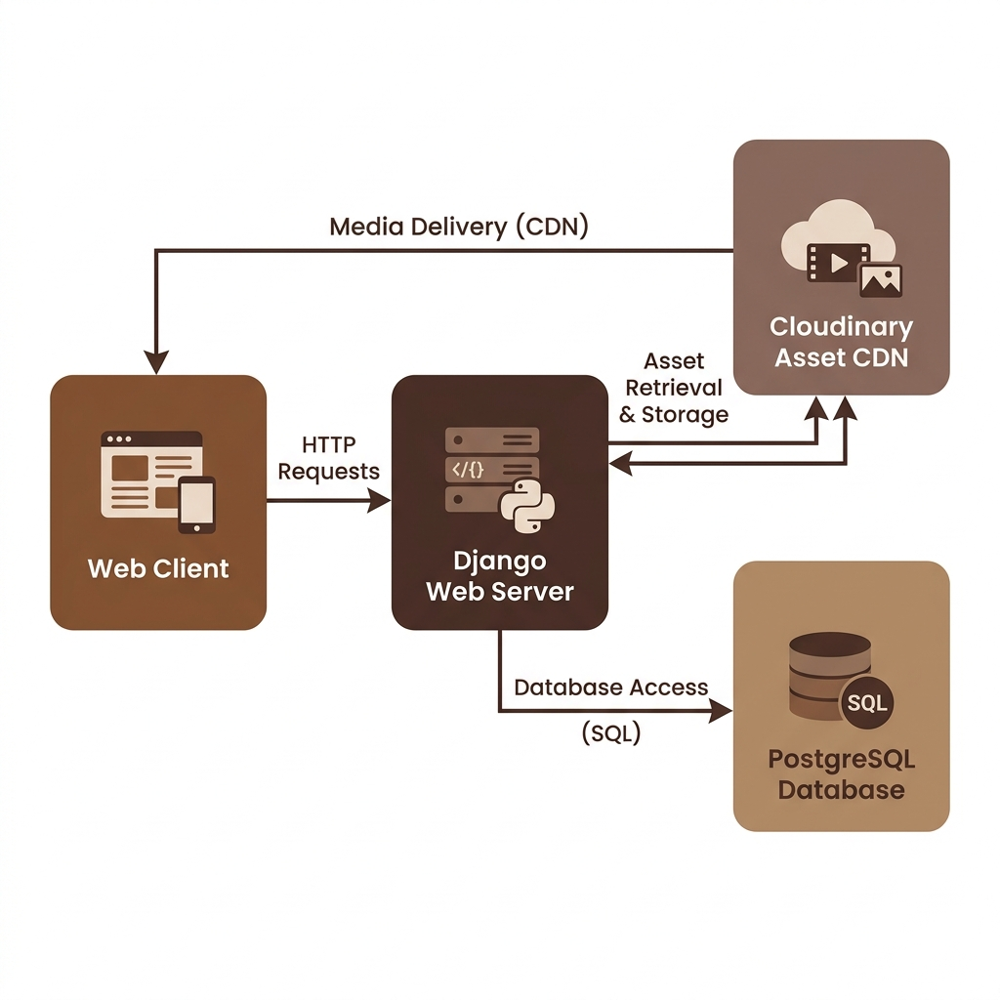

# ☕ Caramel Macchiato Developer Portfolio
> A Premium, Warm Artisan Minimalist Portfolio built on Django & Vanilla CSS.

<p align="center">
  <a href="https://github.com/bharathkumarkarri/Portfolio"></a>
  <a href="https://www.djangoproject.com/"></a>
  <a href="https://cloudinary.com/"></a>
  <a href="https://render.com/"></a>
</p>

---

## 📖 Table of Contents
1. [✨ Core Features](#-core-features)
2. [🎨 Design Tokens & Aesthetic System](#-design-tokens--aesthetic-system)
3. [🏗️ System Architecture](#️-system-architecture)
4. [🛠️ Technical Tech Stack](#️-technical-tech-stack)
5. [📂 Directory structure](#-directory-structure)
6. [💻 Local Development Setup](#-local-development-setup)
7. [⚙️ Cloudinary Asset Integration](#️-cloudinary-asset-integration)
8. [🔧 Custom Admin Order Controls](#-custom-admin-order-controls)
9. [☁️ Production Deployment on Render](#️-production-deployment-on-render)
10. [📄 License & Contact](#-license--contact)

---

## ✨ Core Features

* **💼 Tailored Showcases**: Showcase engineering projects with dedicated details subpages, live application anchors, and GitHub codebase links.
* **🔢 User-Controlled Ordering**: Set custom sorting orders directly from the Django admin list views for your projects, skills, education, experience, and certificates.
* **📄 Integrated Document Storage**: Built-in PDF resume uploading, serving, and automated cleanups (automatically deletes old versions on overwrite to avoid cloud storage bloat).
* **✉️ Frictionless Contact Panel**: Direct "Get in Touch" panel that redirects user inquiries directly to your mailbox with pre-formatted subjects.
* **⚡ Glassmorphic Navigation**: A sticky header bar utilizing `backdrop-filter` blur transitions, interactive hover badges, and responsive sidebar menus on mobile.
* **☁️ Production Database Safety**: Resolves deferred index collision bugs on PostgreSQL by isolating fields and indexing in isolated, sequential database migration steps.

---

## 🎨 Design Tokens & Aesthetic System

The interface uses a custom-tailored **Warm Artisan Minimalism** (Caramel Macchiato) color palette and font system, designed to look extremely premium.

### Color System
| Variable | Value | Concept |
| :--- | :--- | :--- |
| `--bg-base` | `#faf8f5` | Creamy warm ivory latte background |
| `--bg-surface` | `rgba(255, 255, 255, 0.72)` | Translucent white frosting |
| `--text-primary` | `#2c1b11` | Roasted Espresso (high-contrast text) |
| `--text-secondary` | `#5c473c` | Cinnamon Cocoa (secondary headers) |
| `--primary` | `#8d6e63` | Caramel Chocolate (accents & branding) |
| `--accent` | `#d4a373` | Honey Amber gradient glows |

### Typographical Settings
- **Headings**: Elegant serif `Playfair Display`
- **Body & Elements**: Clean, geometric sans-serif `Inter`

---

## 🏗️ System Architecture

<p align="center">
  
</p>

---

## 🛠️ Technical Tech Stack

- **Backend Logic**: Django 6.0 (MTV architectural pattern)
- **Styling Design**: Custom Vanilla CSS (no heavy utility libraries, maintaining 100% style customizability)
- **Asset CDN Handling**: Cloudinary (SDK integration via `django-cloudinary-storage`)
- **Static Assets Delivery**: WhiteNoise (compresses and caches static resources in production)
- **Database Engine**: PostgreSQL (Render Web Database) / SQLite (Local testing)
- **WSGI Server**: Gunicorn

---

## 📂 Directory Structure

```
portfolio/
│
├── jobs/                       # Portfolio Core Application
│   ├── migrations/             # Safe database scheme migrations
│   ├── templates/jobs/         # HTML structure files
│   │   ├── home.html           # Main portfolio landing template
│   │   ├── project.html        # Detailed single-project template
│   │   ├── projects_list.html  # All-projects catalog page
│   │   └── certificates_list.html  # Certificates collection page
│   ├── admin.py                # Admin dashboard configurations (inline lists)
│   ├── models.py               # Core ORM structures (Job, Profile, etc.)
│   └── views.py                # Business queries & view routes
│
├── portfolio/                  # Configuration Module
│   ├── settings.py             # Global setup, keys, and middleware
│   └── urls.py                 # Main URL routing dictionary
│
├── static/                     # Global CSS and images
├── build.sh                    # Automation builder script for Render web service
└── requirements.txt            # Python dependencies requirements file
```

---

## 💻 Local Development Setup

Follow these steps to run the application on your computer:

### 1. Clone the Project & Navigate in:
```bash
git clone https://github.com/bharathkumarkarri/Portfolio.git
cd Portfolio
```

### 2. Set Up a Virtual Environment:
```bash
python3 -m venv .venv
source .venv/bin/activate  # Windows: .venv\Scripts\activate
```

### 3. Install Dependencies:
```bash
pip install -r requirements.txt
```

### 4. Create local migrations and apply:
```bash
python3 manage.py makemigrations
python3 manage.py migrate
```

### 5. Create a Superuser:
```bash
python3 manage.py createsuperuser
```

### 6. Boot Up the Development Server:
```bash
python3 manage.py runserver
```
Navigate to: `http://127.0.0.1:8000/`

---

## ⚙️ Cloudinary Asset Integration

To serve dynamic uploads (project images, PDF resumes) over CDN, register a free Cloudinary account and set these environment variables locally or in your deployment:

```env
CLOUDINARY_CLOUD_NAME=your_cloud_name
CLOUDINARY_API_KEY=your_api_key
CLOUDINARY_API_SECRET=your_api_secret
```

> [!TIP]
> In local development, the codebase gracefully overrides connection warnings with dummy credentials if they are absent, allowing local preview without configuring cloud setups.

---

## 🔧 Custom Admin Order Controls

You can easily reorder items displayed on the homepage directly within the Django admin:

1. Visit the admin dashboard at `http://127.0.0.1:8000/admin`.
2. Under the relevant section (e.g. **Jobs**, **Skills**, **Experiences**, **Certificates**), you will see an **Order** column.
3. Edit the numbers directly in the list (e.g. set `0` for top item, `1` for second, `2` for third...) and click **Save** at the bottom.
4. The site will immediately update to reflect your defined ordering sequence.

---

## ☁️ Production Deployment on Render

This repository is optimized for deployment as a **Web Service** on **Render**.

### Configurations Checklist:
1. Link your GitHub repository to your Render panel.
2. In the **Environment Variables** panel, add:
   - `SECRET_KEY` (production key string)
   - `RENDER` = `True`
   - `DATABASE_URL` (PostgreSQL connection string)
   - `CLOUDINARY_CLOUD_NAME`, `CLOUDINARY_API_KEY`, `CLOUDINARY_API_SECRET`
3. Configure the following build directives:
   - **Build Command**: `./build.sh`
   - **Start Command**: `gunicorn portfolio.wsgi:application`

---

## 📄 License & Contact

Distributed under the MIT License. See [LICENSE](file:///Users/pavan/Documents/portfolio/LICENSE) for more details.

- **Developer**: Karri Bharath Kumar
- **LinkedIn**: [@bharath-kumar-karri](https://www.linkedin.com/in/bharath-kumar-karri/)
- **GitHub**: [@bharathkumarkarri](https://github.com/bharathkumarkarri)
- **Email**: [bharath.karri23@gmail.com](mailto:bharath.karri23@gmail.com)
